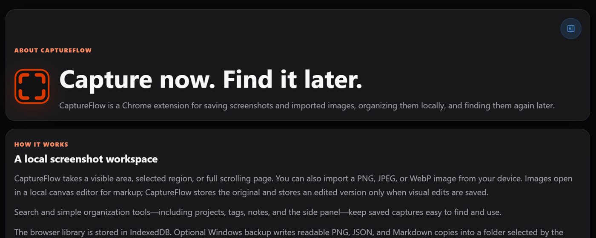
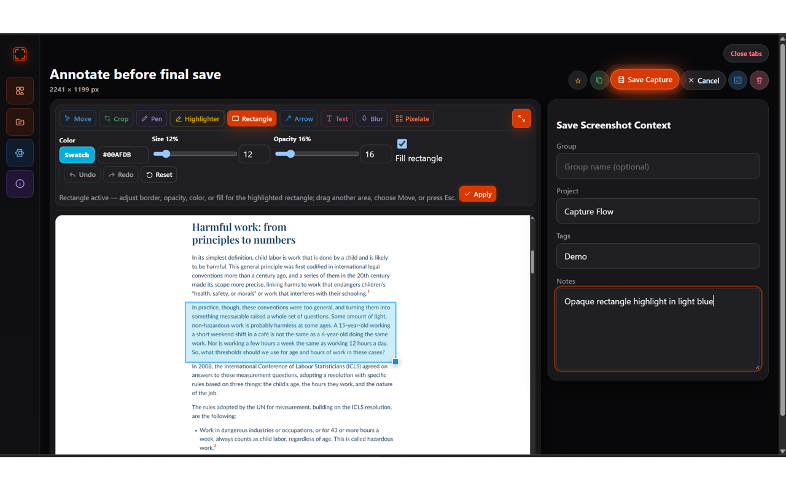
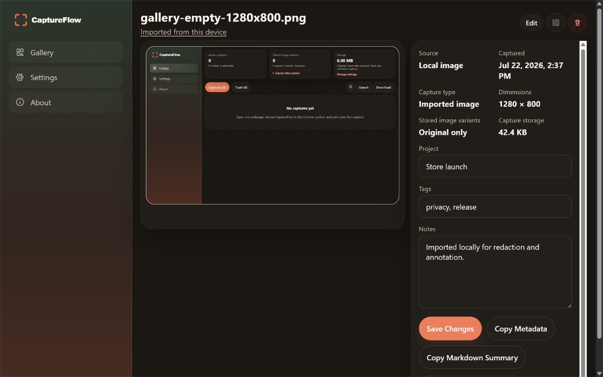
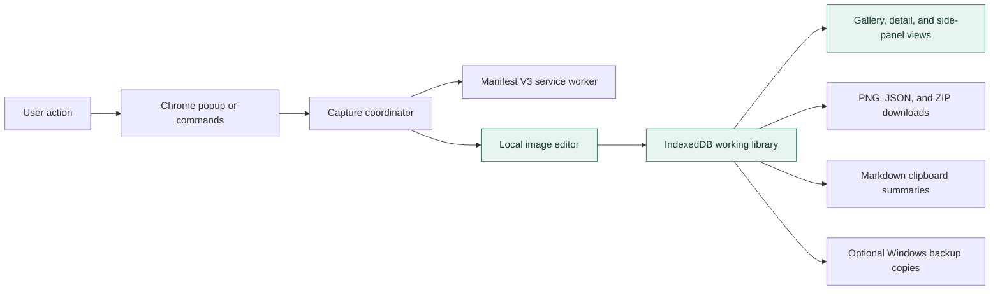

# CaptureFlow

  <strong>Capture now. Find it later.</strong> 
  A private, searchable screenshot and image workspace for Chrome.

  <code>Current release: v0.2.0</code> · Chrome 116+ · No account · No cloud sync

  <a href="https://chromewebstore.google.com/detail/captureflow/hednpbkmifhjcpjfpncneleonhaknpdk">Chrome Web Store</a> ·
  <a href="https://5c0ttp.github.io/captureflow/">Website</a> ·
  <a href="https://5c0ttp.github.io/captureflow/support.html">Support</a> ·
  <a href="https://5c0ttp.github.io/captureflow/privacy-policy.html">Privacy</a>

CaptureFlow captures webpages or imports local images, opens them in a non-destructive annotation editor, and keeps the images with searchable notes, tags, projects, and groups in the current Chrome profile.

This is CaptureFlow's official public repository for product information, screenshots, support resources, privacy documentation, release information, and public issue tracking. The production extension source and store build pipeline are not distributed here.

## What's new in v0.2.0

- Redesigned Dark and Light themes, plus System and Original themes
- Longer full-page captures with improved handling of repeated fixed and sticky page elements
- User-created groups in the full Gallery and compact side-panel Gallery
- Autocomplete for groups, projects, and tags with keyboard-first navigation
- Improved text, rectangle, and arrow placement and adjustment
- Movable, aspect-ratio-preserving text and an Apply workflow for rectangles and arrows
- Adjustable arrow size, color, and opacity with a sharper arrowhead
- Non-destructive editing from either the original or edited image
- Automatically saved preferences with visible save status
- Updated icon, popup, sidebar, and higher-contrast controls

## Product tour

| Capture from the popup | Search and organize |
| --- | --- |
|  |  |

| Annotate locally | Position shapes before applying |
| --- | --- |
|  |  |

| Import and pixelate local images |
| --- |
|  |

## What CaptureFlow does

### Capture and import

- Capture the visible area, draw a selected region, or stitch a full scrolling page
- Import PNG, JPEG, and WebP images
- Open new captures and imports directly in the local editor
- Keep original and edited image variants separately in IndexedDB

### Annotate

- Crop, pen, highlighter, rectangle, arrow, text, blur, and pixelation tools
- Undo, redo, reset, and adjustable tool color, size, and opacity where applicable
- Move and resize text, rectangles, and arrows before committing them
- Re-edit from the original or latest edited image without overwriting the original
- Use an always-available web-safe font set without installed-font permission

### Organize and find

- Search page titles, URLs, domains, notes, tags, projects, and groups
- Filter by group, project, tag, domain, date, capture type, favorite, or possible duplicate
- Sort by capture date, title, or domain
- Create, rename, and delete groups; move one or many captures between them
- Add notes, projects, tags, and favorites
- Choose compact, standard, or expanded Gallery cards
- Use the full Gallery in a tab or the compact Gallery in Chrome's side panel

### Download, back up, and recover

- Download original or edited PNG copies
- Download selected captures or the full active library as a ZIP with JSON metadata
- Download library metadata as JSON or copy an individual capture summary as Markdown
- Optionally write readable PNG, JSON, and Markdown backup copies to a Windows folder
- Move deleted captures to Trash, then restore them or permanently empty Trash
- Detect likely duplicates with an approximate average-hash comparison

## Local-first architecture

The IndexedDB library is the source of truth. Downloads, ZIP exports, clipboard content, and optional Windows folder files are one-way copies. CaptureFlow cannot currently restore its working library from those files.

CaptureFlow has no backend, account system, analytics, advertising, cloud upload, or remote image processing.

## Technology

- TypeScript and React 18
- Chrome Extension Manifest V3
- Vite and CRXJS
- IndexedDB and the File System Access API
- Canvas-based image editing
- Node's built-in test runner with `fake-indexeddb`

## Chrome permissions

- `activeTab`: capture the active page after a user starts a capture
- `scripting`: read page metadata, show region selection, and scroll pages for full-page capture
- `downloads`: save user-requested PNG, JSON, and ZIP files
- `sidePanel`: display the compact Gallery beside the current page
- Optional `<all_urls>` host access: keep user-initiated capture available after switching tabs in the side panel; it is not granted at installation

CaptureFlow does not request browsing-history, account, analytics, or `storage` permissions.

## Install and support

Install CaptureFlow from the [Chrome Web Store](https://chromewebstore.google.com/detail/captureflow/hednpbkmifhjcpjfpncneleonhaknpdk).

- [Product website](https://5c0ttp.github.io/captureflow/)
- [Support](https://5c0ttp.github.io/captureflow/support.html)
- [Troubleshooting](https://5c0ttp.github.io/captureflow/troubleshooting.html)
- [Frequently asked questions](https://5c0ttp.github.io/captureflow/faq.html)
- [Privacy policy](https://5c0ttp.github.io/captureflow/privacy-policy.html)

## Current limitations

- Full-page output is capped at 20,000 pixels on either dimension and 100 million output pixels; larger pages are downscaled
- Sticky content, lazy-loaded content, nested scrollers, and scroll animations can still produce imperfect full-page stitches
- Duplicate detection is approximate
- ZIP and JSON library import/restore are not implemented
- Windows backup is one-way and cannot rebuild the in-app library automatically
- There is no cloud sync, team sharing, account, or backend
- Clearing Chrome extension data can permanently remove the working library

## License

CaptureFlow's name, branding, screenshots, documentation, and other public materials remain proprietary. All rights are reserved. See [LICENSE](LICENSE).
