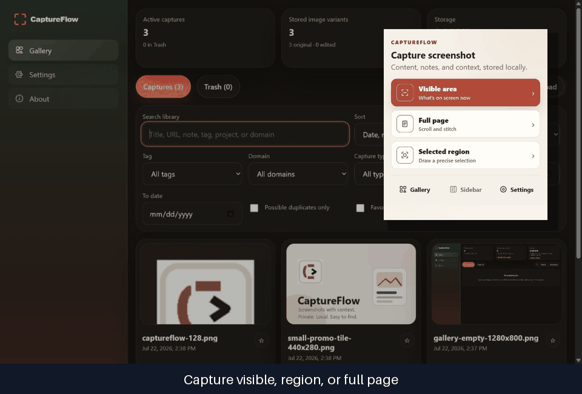
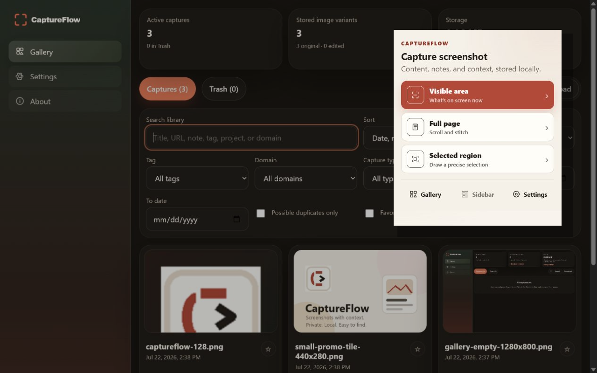
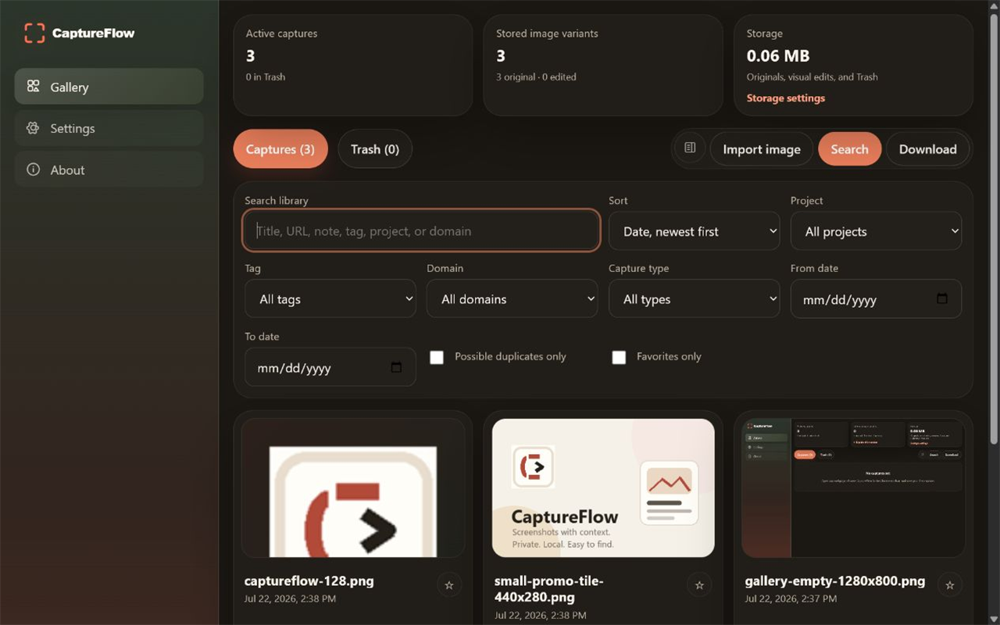
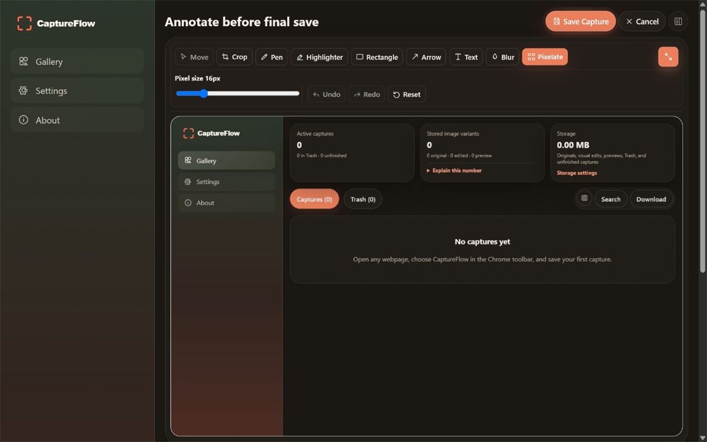
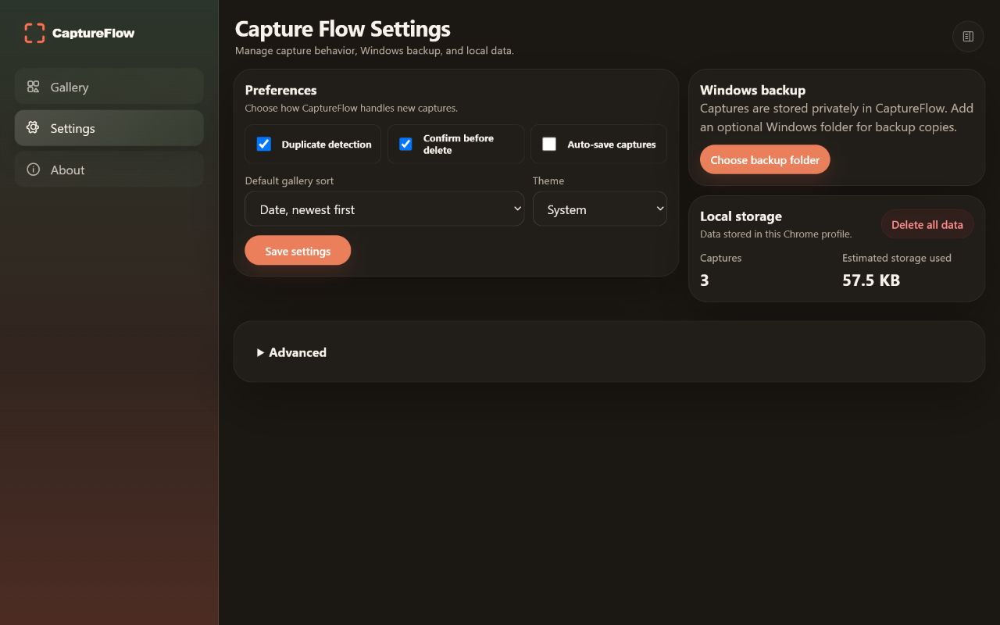
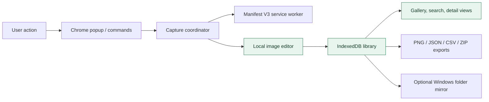

# CaptureFlow
Link: https://chromewebstore.google.com/detail/captureflow/hednpbkmifhjcpjfpncneleonhaknpdk

CaptureFlow is a privacy-first Chrome extension that turns screenshots into a searchable, locally stored work library. It combines capture, annotation, organization, export, and optional Windows folder mirroring without requiring an account, backend, analytics service, or cloud sync.

> This is a portfolio showcase. The production source code and Chrome Web Store build pipeline are maintained in a private repository.

## Product highlights

- Capture the visible viewport, a selected region, or a stitched full page
- Import PNG, JPEG, and WebP images into the same workflow
- Annotate with crop, pen, highlighter, shapes, arrows, text, blur, and pixelation
- Organize captures with notes, tags, projects, favorites, search, filters, and duplicate detection
- Export individual images, Markdown, JSON, CSV, and multi-capture ZIP archives
- Mirror readable copies to a user-selected Windows folder while keeping IndexedDB authoritative
- Recover deleted captures from Trash before permanent removal
- Use a compact Chrome side-panel gallery or the full management interface

## Product tour

| Capture | Searchable gallery |
| --- | --- |
|  |  |

| Local editor | Storage controls |
| --- | --- |
|  |  |

## Architecture

The browser database is the source of truth. Downloads and Explorer mirror files are deliberately treated as copies, which keeps storage ownership and deletion behavior predictable. Capture work is split between the user-facing surfaces and a Manifest V3 service worker, with shared TypeScript modules defining domain behavior.

## Technology stack

- TypeScript with strict compiler settings
- React 18
- Chrome Extension Manifest V3
- Vite and CRXJS
- IndexedDB and the File System Access API
- Canvas-based image editing
- Node's built-in test runner with `fake-indexeddb`
- GitHub Actions for automated verification

## Engineering practices demonstrated

- Permission-minimized browser-extension design with optional host access
- Transactional local persistence and explicit Trash lifecycle
- Separation between authoritative records and exported copies
- Unit and integration coverage for capture, storage, editor geometry, exports, and browser surfaces
- Reproducible store packaging with manifest and remote-code auditing
- Release checklists, privacy disclosures, reviewer instructions, and store listing documentation
- Issue-driven planning, milestone tracking, pull-request review, and tagged releases

## Representative code

The [`samples`](samples/) directory contains small, portfolio-safe excerpts showing the project’s domain modeling and collection-query approach. These samples are intentionally incomplete and cannot be used to reconstruct or build CaptureFlow.

- [`capture-model.ts`](samples/capture-model.ts) — representative domain types and storage boundaries
- [`collection-query.ts`](samples/collection-query.ts) — deterministic filtering and sorting example

## Installation overview

CaptureFlow is distributed as a packaged Chrome extension. A release build is compiled, audited for disallowed remote code, packaged with its Manifest V3 metadata and icons, then submitted to the Chrome Web Store. The complete source and store-build scripts are not distributed from this showcase.

For product support and privacy information:

- [CaptureFlow support](https://5c0ttp.github.io/captureflow/support.html)
- [Privacy policy](https://5c0ttp.github.io/captureflow/privacy-policy.html)

## Project status

CaptureFlow is under active private development. Public issues and milestones in this repository document product-level planning and engineering decisions without exposing proprietary implementation details.

## License

This repository is source-available for portfolio evaluation only and is **not open source**. All rights are reserved. See the [CaptureFlow Portfolio License](LICENSE).
